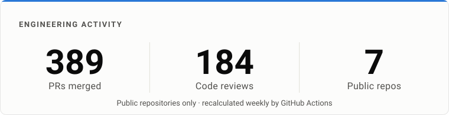
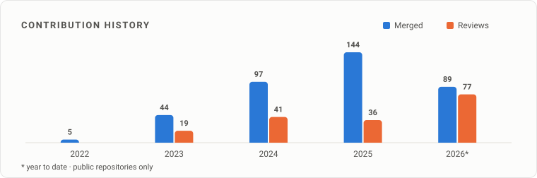

# Thinh Nguyen

**Software Engineer** — backend systems, AI applications, and developer tools, with a focus on understanding how things work under the hood.

`Java` · `AI/LLM` · `Backend` · `Developer Tools` · `Open Source`

[GitHub](https://github.com/nhthinh-axonivy) · [LinkedIn](https://www.linkedin.com/in/nhthinh8299/) · [CV](https://nhthinh-axonivy.github.io/my-cv/) · [Email](mailto:nht.8299@gmail.com)

<!-- ACTIVITY:START -->
<picture>
  <source media="(prefers-color-scheme: dark)" srcset="activity-dark.svg">
  
</picture>
<!-- ACTIVITY:END -->

## What I Build

```json
{
  "ships": {
    "guardrails": ["prompt-injection", "PII", "observability"],
    "llm": ["LangChain4j", "Azure OpenAI", "Ollama", "OpenSearch"],
    "platform": ["Jakarta EE", "PrimeFaces 15", "ARIA", "authorization"]
  },
  "stack": {
    "backend": ["Java", "Spring Boot", "REST", "PostgreSQL"],
    "frontend": ["TypeScript", "React", "VS Code"],
    "engineering": ["Docker", "GitHub Actions", "Jenkins", "Selenide"]
  }
}
```

<sub>Upstreamed to LangChain4j: [`guardrailName()` on `GuardrailExecutedEvent`](https://github.com/langchain4j/langchain4j/pull/4940) · [Azure OpenAI Netty fallback](https://github.com/langchain4j/langchain4j/pull/5355)</sub>

## Open Source

<!-- OSS:START -->
| Repository | Merged | Reviewed |
| :--- | ---: | ---: |
| [portal](https://github.com/axonivy-market/portal) | 348 | 156 |
| [mobileapp](https://github.com/axonivy-market/mobileapp) | 25 | 17 |
| [smart-workflow](https://github.com/axonivy-market/smart-workflow) | 11 | 10 |
| **[langchain4j](https://github.com/langchain4j/langchain4j)** ★13.1k | 2 | 1 |
| [ai-assistant](https://github.com/axonivy-market/ai-assistant) | 1 | 0 |
| [axonivy-express](https://github.com/axonivy-market/axonivy-express) | 1 | 0 |

<sub>388 merged · 184 reviewed across 6 public repos outside my own account. Plain rows are axonivy-market products; **bold** rows are community open source.</sub>
<!-- OSS:END -->


## Activity Over Time

<!-- HISTORY:START -->
<picture>
  <source media="(prefers-color-scheme: dark)" srcset="history-dark.svg">
  
</picture>
<!-- HISTORY:END -->

**Now** — building AI developer tooling and LLM applications in Java, and contributing upstream to the libraries I depend on.

---

> Building things, breaking things, and learning how they work.
